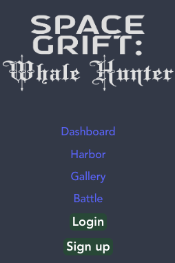

# Space Grift: Whale Hunter
[](https://creativecommons.org/licenses/by-nc-sa/4.0/)



## Description

A parody game making fun of the worst of NFT's and gacha games. Built in the MERN stack as a tech demo. Hunt whales! Earn ridiculous items! Trust us bro, they'll totally go up in value! !hat's just the way things go ... right?

## Table of Contents

- [Installation](#installation)
- [Usage](#usage)
- [Credits](#credits)
- [Tests](#tests)
- [Contributing](#contributing)
- [Questions](#questions)
- [License](#license)

## Installation

Run ```npm i``` in the top level of the repo.

## Usage

To run a local development version of the app, run ```npm run develop``` in the top level of the repo.

## Credits

[Gordon-Magill](https://github.com/Gordon-Magill)

[arielle-elak](https://github.com/arielle-elak)

[CArmstrong2](https://github.com/CArmstrong2)


## Tests

No tests implemented at this time.

## Contributing

Not accepting contributions at this time, but feel free to fork!

## Questions

[Github: Gordon-Magill](https://github.com/Gordon-Magill)<br>
Email: gordon.magill@gmail.com
Please reach out via provided email for any questions.

## License

Licensed under [Attribution-NonCommmercial-ShareAlike 4.0 International](https://creativecommons.org/licenses/by-nc-sa/4.0/).